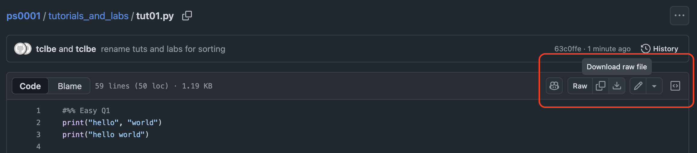

You can download files from GitHub by navigating to the file you want to download.
At the top-right corner of the file preview, there is a download icon, also shown below.

# Links

* Week 2: tutorial 1 ([rmd](https://tclbe.github.io/ps0002/week2/tut01.Rmd), [html](https://tclbe.github.io/ps0002/week2/tut01.html), [pdf](https://tclbe.github.io/ps0002/week2/tut01.pdf))
and lab 1 ([rmd](https://tclbe.github.io/ps0002/week2/lab01.Rmd), [html](https://tclbe.github.io/ps0002/week2/lab01.html), [pdf](https://tclbe.github.io/ps0002/week2/lab01.pdf))

* Week 3: tutorial 2 ([rmd](https://tclbe.github.io/ps0002/week3/tut02.Rmd), [html](https://tclbe.github.io/ps0002/week3/tut02.html), [pdf](https://tclbe.github.io/ps0002/week3/tut02.pdf))
and lab 2 ([rmd](https://tclbe.github.io/ps0002/week3/lab02.Rmd), [html](https://tclbe.github.io/ps0002/week3/lab02.html), [pdf](https://tclbe.github.io/ps0002/week3/lab02.pdf))

* Week 4: tutorial 3 ([rmd](https://tclbe.github.io/ps0002/week4/tut03.Rmd), [html](https://tclbe.github.io/ps0002/week4/tut03.html), [pdf](https://tclbe.github.io/ps0002/week4/tut03.pdf))

* Week 5: tutorial 4 ([rmd](https://tclbe.github.io/ps0002/week5/tut04.Rmd), [html](https://tclbe.github.io/ps0002/week5/tut04.html), [pdf](https://tclbe.github.io/ps0002/week5/tut04.pdf))
and lab 4 ([rmd](https://tclbe.github.io/ps0002/week5/lab04.Rmd), [html](https://tclbe.github.io/ps0002/week5/lab04.html), [pdf](https://tclbe.github.io/ps0002/week5/lab04.pdf))

* [Tutorial 5](https://tclbe.github.io/ps0002/tuts-and-labs/html/tut05.html)
* [Lab 5](https://tclbe.github.io/ps0002/tuts-and-labs/html/lab05.html)

* [Tutorial 6](https://tclbe.github.io/ps0002/tuts-and-labs/html/tut06.html)
* [Lab 6](https://tclbe.github.io/ps0002/tuts-and-labs/html/lab06.html)

* [Tutorial 7](https://tclbe.github.io/ps0002/tuts-and-labs/html/tut07.html)

* [Tutorial 8](https://tclbe.github.io/ps0002/tuts-and-labs/html/tut08.html)
* [Lab 8](https://tclbe.github.io/ps0002/tuts-and-labs/html/lab08.html)

* [Tutorial 9](https://tclbe.github.io/ps0002/tuts-and-labs/html/tut09.html)

* [Tutorial 10](https://tclbe.github.io/ps0002/tuts-and-labs/html/tut10.html)
* [Lab 10](https://tclbe.github.io/ps0002/tuts-and-labs/html/lab10.html)
